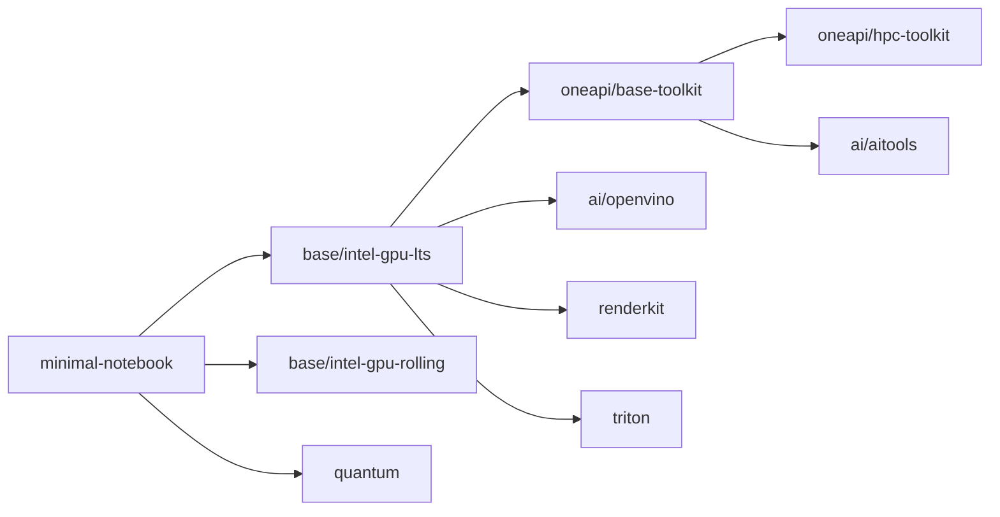
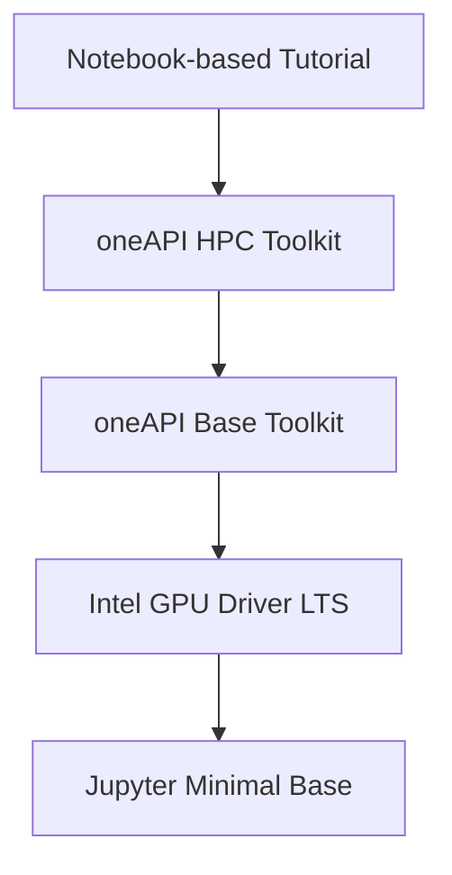

# Intel Software Docker Images

> Note: These are not official images from Intel. Please see [oneapi-containers](https://github.com/intel/oneapi-containers) and [ai-containers](https://github.com/intel/ai-containers) for official images. Thanks!

## Overview

This repository extends [docker-stacks](https://github.com/jupyter/docker-stacks) images with various Intel software components intended for deployment in JupyterLab environments.

## Contents

This repository holds both container images, and fully composed learning notebooks built on top of those images.

### Images

| Category  | Name              | Status                                                                                                                                                                                                       | More Details |
| --------- | ----------------- | ------------------------------------------------------------------------------------------------------------------------------------------------------------------------------------------------------------ | --- |
| ai        | AI Tools          |            | [📄](https://www.intel.com/content/www/us/en/developer/topic-technology/artificial-intelligence/frameworks-tools.html) |
| ai        | openVino          |                     | [📄](https://www.intel.com/content/www/us/en/developer/tools/openvino-toolkit/overview.html) |
| oneAPI    | Base Toolkit      |  | [📄](https://www.intel.com/content/www/us/en/developer/tools/oneapi/base-toolkit.html) |
| oneAPI    | HPC Toolkit       |     | [📄](https://www.intel.com/content/www/us/en/developer/tools/oneapi/hpc-toolkit.html) |
| quantum   | Quantum SDK       |      | [📄](https://www.intel.com/content/www/us/en/developer/tools/quantum-sdk/overview.html) |
| rendering | RenderKit         |                  | [📄](https://www.intel.com/content/www/us/en/developer/tools/oneapi/rendering-toolkit.html) |

### Image Relationships

### Notebooks

Notebooks are step-by-step tutorials to learn and explore new software concepts, techniques, and frameworks. A notebook file and its supporting assets are built into a container image containing the necessary software for that particular learning activity.

## Usage

### Background

Docker images are built in layers, allowing for efficient reuse and incremental updates. When creating a new image, Docker starts with a base image (e.g., Ubuntu or Alpine Linux). Each subsequent instruction in the Dockerfile (e.g., installing dependencies, copying files, or setting environment variables) adds a new layer on top of the base image. These layers are stacked and cached, enabling fast rebuilds and minimizing redundant work.

This layered architecture enables Docker images to inherit from previous images, promoting modularity and reducing storage requirements. As changes are made, only the affected layers are rebuilt, while unchanged layers remain intact, optimizing image size and build times.

For example, a tutorial could utilize the oneAPI HPC Toolkit, which itself is layered atop the oneAPI Base Toolkit and a minimal Jupyter image.

As a user, I would just need to focus on the `oneAPI HPC Toolkit` image, using it in my Dockerfile's `FROM` statement, and the rest is handled.

### Creating an Image

