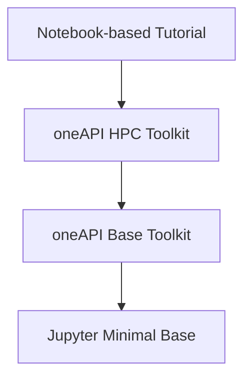

# Intel Software Docker Images 

> Note: These are not official images from Intel. Please see [oneapi-containers](https://github.com/intel/oneapi-containers) and [ai-containers](https://github.com/intel/ai-containers) for official images. Thanks!

## Overview

This repository extends [docker-stacks](https://github.com/jupyter/docker-stacks) images with various Intel software components intended for deployment in JupyterLab environments.

## Contents

This repository holds both container images, and fully composed learning notebooks built on top of those images.

### Images

| Category | Name | Status |
| --- | --- | --- |
| ai | AI Tools |  |
| ai | openVino |  |
| oneAPI | Base Toolkit |  |
| oneAPI | HPC Toolkit |  |
| quantum | Quantum SDK |  |
| rendering | Rendering Toolkit | TODO |

### Notebooks

TODO

### Usage

Images build off of each other in layers to add specific software capablities. Jupyter Notebooks can then be easily added that utilize the included software. 

For example, a tutorial could utilize the oneAPI HPC Toolkit, which itself is layered atop the oneAPI Base Toolkit and a minimal Jupyter image.

```mermaid
graph TD;
    3[Notebook-based Tutorial]
    2[oneAPI HPC Toolkit]
    1[oneAPI Base Toolkit]
    0[Jupyter Minimal Base]
    3 --> 2 --> 1 --> 0
```